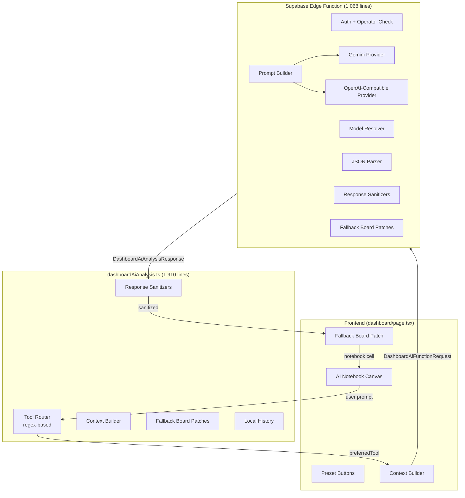

# Dashboard AI Agent — Analysis & Improvement Suggestions

## Current Architecture Summary



### Flow

1. User types a prompt or clicks a preset in the **AI Notebook Canvas**
2. Frontend builds a `DashboardAiContext` (comparison results, season catalog, waterfall rows, driver records) and sends it with the prompt to the Supabase Edge Function
3. Edge Function authenticates the user, resolves the AI model from `operational_settings`, builds a monolithic text prompt with inline JSON context, and calls either **Gemini** or an **OpenAI-compatible** provider
4. The LLM returns free-text (optionally with embedded JSON); the Edge Function parses structured payloads (`dataRequest`, `exportAction`, `visualReport`, `boardPatch`, `toolTraceSummary`) and sanitizes them
5. Frontend receives the response. If no `boardPatch` was returned but the intent was a board request, a **deterministic fallback** board patch is generated client-side
6. The notebook cell renders: assistant text, inline blocks (KPI, table, chart, insight-list), tool trace badges, and export actions

---

## What Works Well

| Aspect | Detail |
|---|---|
| **Security** | Strict auth + operator gate; API keys never exposed to frontend; all AI output sanitized through whitelists |
| **Structured output** | Response sanitizers validate every block type, chart type, table template against hardcoded allowlists — no arbitrary HTML/SQL/scripts |
| **Bilingual routing** | Tool routing handles Vietnamese (with/without diacritics) and English prompts via regex normalization |
| **Fallback resilience** | If the LLM doesn't return a `boardPatch`, deterministic fallback patches ensure the notebook always renders something useful |
| **Read-only boundary** | The AI agent cannot mutate flight records, sync state, or database schema |
| **Local-first notebook** | Notebook persistence in localStorage means no extra server writes for AI conversations |

---

## Issues & Improvement Opportunities

### 1. Massive Code Duplication Between Client and Edge Function

> [!CAUTION]
> ~800 lines of logic are duplicated nearly verbatim between `dashboardAiAnalysis.ts` and the Edge Function `index.ts`.

**Duplicated code includes:**
- All `sanitize*` functions (visual report, board patch, workspace blocks, charts, tables, filters)
- All `is*Prompt` intent detection functions (`isDriverPrompt`, `isPeakHourPrompt`, etc.)
- All `default*BoardPatch` fallback builders
- All `workspace*Block` helper factories
- `normalizePrompt`, `optionalEnum`, `optionalIsoDate`, `optionalTextList`, etc.

**Why this matters:** A bug fix or new tool/block type requires changing both files identically. Past backups suggest this has already caused divergence risks.

**Suggestion:** Extract shared types and sanitizer logic into a `_shared/dashboardAiShared.ts` module that both the Edge Function and the frontend import. The Edge Function's Deno import map can resolve from the same relative path.

---

### 2. Regex-Based Tool Routing Is Fragile

The current tool selection uses cascading regex tests:

```typescript
if (/\b(ai workspace|workspace|whiteboard|board|canvas|...)/.test(normalized)) {
  return 'compose_dashboard_ai_board';
}
```

**Problems:**
- **False positives:** "Export the driver table to Excel" matches `table` → routes to `compose_dashboard_ai_board` instead of `suggest_template_report`
- **Ordering sensitivity:** The cascade priority determines behavior. A prompt matching multiple regexes silently takes the first hit
- **No confidence score:** No way to know how well the routing matched
- **Maintenance burden:** Adding new Vietnamese synonyms requires editing multiple regex patterns in multiple files

**Suggestion:** Let the LLM handle tool selection instead of client-side regex. The Edge Function already sends `allowedTools` and `preferredTool`. Two options:
- **(a) Structured output / function calling:** Use Gemini's function calling API or OpenAI's `tool_choice` parameter so the model itself picks the correct tool and returns structured parameters
- **(b) Two-phase prompt:** First ask the LLM to return a `{"selectedTool": "...", "reason": "..."}` JSON, then validate server-side before processing

Either approach eliminates the fragile regex cascade and handles ambiguous natural-language prompts more robustly.

---

### 3. The 2-Round Limit Is Too Restrictive for Data Exploration

Context (line 175 of `context.md`):
> The V1 bounded loop allows at most 2 provider rounds: initial request, optional validated `dataRequest → resolvedDataRequest`, then final answer.

In practice, the user asks "show me VJ flights in July and August for routes with >50% drop" — this requires:
1. A `dataRequest` to fetch July + August data
2. Analysis of the resolved data
3. Possibly another slice for comparison baseline

With `maxRounds: 2`, the agent can only do step 1 + 2. If the data is insufficient, it stops.

**Suggestion:** Increase to 3–4 rounds with a tighter per-round cost cap (limit `maxRecords` per request). Add a `totalTokenBudget` guard in the Edge Function instead of a hard round count. This allows multi-step analytical workflows while still bounding cost.

---

### 4. No Conversation Memory Across Cells

Each notebook cell is an independent request. The `history` array sent to the Edge Function is capped at 6 messages and only carries `{role, content}` pairs — **no blocks, no resolved data, no tool trace.**

**Impact:** If the user says "now break that down by route" after a previous cell showed airline analysis, the AI has no context about what "that" refers to.

**Suggestion:**
- Include the previous cell's `boardPatch` summary (block types/titles) in the next request's context
- Implement a `cellContext` field: `{ previousBlocks: [{type, title, templateId}], previousFilters: {...} }`
- This is lightweight (~200 bytes) and gives the LLM enough to understand follow-up prompts

---

### 5. No Streaming — Long Wait Times with No Feedback

The current flow waits for the entire LLM response before parsing and rendering. The `aiLoadingMessage` state shows a static "AI is analyzing data..." message.

**Impact:** For complex prompts with large context payloads, the user sees a spinner for 10–30 seconds with no progress indication.

**Suggestion:**
- **(Quick win):** Add phased loading messages: "Preparing context..." → "Calling AI provider..." → "Processing response..."
- **(Full solution):** Use Server-Sent Events (SSE) from the Edge Function to stream `assistantText` as it arrives. Parse structured JSON only after the stream completes. This gives the user immediate text feedback while blocks render after.

---

### 6. Context Payload Is Bloated

The `DashboardAiContext` is sent as raw JSON in the prompt text. For a season with 20k+ records, the `seasonCatalog` alone can reach 4–8KB, and `waterfallRows` + `selectedDriverRecords` add more.

**Current caps:**
- `DEFAULT_MAX_SELECTED_RECORDS = 16`
- `DEFAULT_MAX_CATALOG_ROWS = 12`

But the full `comparison` object and all `waterfallRows` are always included regardless of relevance.

**Suggestion:**
- Build a **relevance filter** based on the detected tool: if the prompt is about peak hours, exclude waterfall rows and driver records
- Compress the catalog: send only the dimensions relevant to the prompt's detected intent
- This reduces token usage and cost, and improves response quality (less noise for the LLM)

---

### 7. No Error Recovery or Retry Strategy

```typescript
if (error) throw new DashboardAiRequestError(await readFunctionInvokeError(error));
```

A transient network failure, rate limit, or provider timeout produces a single error shown to the user. No retry, no fallback to an alternate model.

**Suggestion:**
- Implement automatic retry with exponential backoff (1 retry for 429/503 status codes)
- If the primary model fails, fall back to the secondary enabled model (you already support multiple models)
- Show the user a "Retry" button with the same prompt instead of requiring them to re-type

---

### 8. Dashboard-Only Scope — No Cross-Feature AI

The AI agent is hardcoded to `ownerWorkflow: 'dashboard-report-analysis'`. It can only analyze dashboard data and cannot help with:
- Seasonal Schedule pattern questions ("which flights operate only on Mon/Wed/Fri?")
- Check-in allocation optimization ("suggest counter assignments for peak hour")
- Import validation ("does this Excel have overlapping periods?")

**Suggestion (V2 scope):** Introduce a lightweight **router agent** that determines the domain (dashboard, seasonal, check-in, import) and delegates to a domain-specific prompt. The existing `allowedTools` mechanism already supports this — you'd add new tool registries per domain.

---

### 9. No Observability / Analytics

There's no logging of:
- Which prompts are used most frequently
- Which tools are selected vs. which the user actually wanted
- Response quality (did the user follow up with a clarification?)
- Token usage per request

**Suggestion:** Log structured analytics to a `ai_usage_logs` Firestore collection or Supabase table:
```typescript
{ promptHash, selectedTool, modelId, roundCount, tokenEstimate, responseTimeMs, hasBlocks, timestamp }
```
This enables data-driven improvements to tool routing, context tuning, and model selection.

---

### 10. Fallback Board Patches Are Static

The 7+ fallback board patches (peak-hour, driver, visual, workspace, table, compare-seasons, difference) are hardcoded with fixed block compositions. They don't adapt to:
- The user's current dashboard filters
- Which metrics/dimensions are selected
- The actual data shape (e.g., if there are no PAX values, a PAX chart is useless)

**Suggestion:** Make fallback patches context-aware:
```typescript
function defaultDriverBoardPatch(filters: DashboardAiFilters): DashboardAiBoardPatch {
  return {
    blocks: [
      workspaceTableBlock('driver-table', 'Driver Contribution Table', 'comparison', 'comparison-drivers', 12),
      workspaceChartBlock('driver-waterfall', 'Driver Waterfall', 'comparison', 'waterfall',
        { dimension: filters.dimension, metric: filters.metric }, 12), // ← use active filters
    ],
  };
}
```

---

## Priority Ranking

| Priority | Issue | Effort | Impact |
|:---:|---|:---:|:---:|
| 🔴 1 | Code duplication (shared module) | Medium | High — maintainability |
| 🔴 2 | LLM-based tool selection | Medium | High — accuracy |
| 🟡 3 | Conversation memory across cells | Low | Medium — UX |
| 🟡 4 | Context relevance filtering | Low | Medium — cost/quality |
| 🟡 5 | Phased loading / streaming | Medium | Medium — UX |
| 🟢 6 | Retry / model fallback | Low | Medium — reliability |
| 🟢 7 | Context-aware fallback patches | Low | Low — quality |
| 🟢 8 | Increase round limit | Low | Low — capability |
| 🟢 9 | Observability / analytics | Medium | Low — future |
| 🟢 10 | Cross-feature AI (V2) | High | High — but future |
