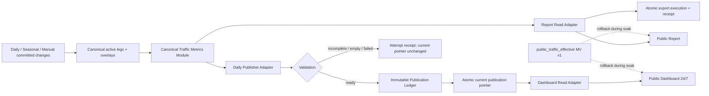

# Kế hoạch implementation — Report live và Dashboard Daily Publication

**Ngày:** 2026-09-01

**Trạng thái:** Release A production hoàn tất; Release B shadow publication và mọi UI cutover còn chờ duyệt

**ADR:** `docs/adr/2026-09-01-report-live-dashboard-daily-publication.md`

## 1. Mục tiêu

Triển khai A+B theo các quyết định:

1. Report đọc live canonical committed data qua Report Read Adapter.
2. Public Dashboard 24/7 đọc latest ready Daily Publication, không gọi live Report Adapter.
3. Cả hai lấy flight/Pax/A-D/daily/status từ Canonical Traffic Metrics Module.
4. Daily Publication được tạo sau daily import/reconciliation acceptance, giữ lịch sử bất biến và chỉ atomic swap khi ready.
5. `Pax NULL` là missing; `Pax 0` là true-zero.

Không nằm trong plan này:

- native PivotTable/template-preserving export Implementation;
- production migration/deploy/refresh khi chưa có phê duyệt riêng;
- retire materialized view trong cùng release cutover;
- thay đổi canonical flight-leg authority hoặc Daily import transaction.

## 2. Cấu trúc đích



## 3. Proposed files

Tên file/migration cuối cùng được chọn khi bắt đầu implement; không tạo migration timestamp giả trước execution.

### Modify

- `app/src/lib/trafficReportV2Contract.ts`
- `app/src/lib/trafficReportDataAdapter.ts`
- `app/src/app/(public-report)/reports/traffic/TrafficReportClient.tsx`
- `app/src/lib/annualPassengerKpiContract.ts`
- `app/src/app/(public-report)/reports/traffic/dashboard/AnnualPassengerKpiDashboard.tsx`
- `app/supabase/functions/traffic-report/index.ts`
- `app/supabase/tests/public_traffic_report_v1_pglite.mjs`
- `app/scripts/traffic-report-edge-contract.test.mjs`
- `app/package.json`
- `docs/runbooks/public-traffic-report-deploy.md`

### Add during implementation

- migration cho Canonical Traffic Metrics Module/read version contract;
- migration cho Publication Ledger/current pointer/publisher/read wrappers;
- TypeScript contract + Adapter tests cho Daily Publication;
- publisher runner/manual helper và systemd unit/timer hoặc acceptance hook đã chọn;
- clone/staging differential runner;
- publication health/receipt validation script.

## 4. Phase 0 — Baseline và supersession guard

### Task 0.1 — Khóa meaning của hai Dashboard

- Public Dashboard: `/reports/traffic/dashboard`, annual KPI wallboard 24/7.
- Desktop Dashboard Report Mode: feature-gated interactive mode trong desktop Dashboard.
- Source tests phải ngăn public Dashboard import/call `trafficReportDataAdapter` live.
- Kế hoạch 2026-08-31 được annotate/supersede ở phần public wallboard; không xóa historical implementation receipt.

### Task 0.2 — Chụp baseline

- Contract/build test hiện tại.
- Clone v1/v2 differential tại cùng watermark và compatible data-as-of.
- Latency warm/cold cho 7 ngày, 30 ngày, YTD và full range.
- Dashboard annual snapshot payload, ETag, cache headers và version poll.
- MV row count, size, refresh time, projection state và watermark.

### Gate 0

- Worktree sạch ngoài commit plan/docs.
- Baseline receipt có timestamp, commit, clone id, row count, watermark và data-as-of.
- Không thay đổi production.

## 5. Phase 1 — Deepen Canonical Traffic Metrics Module

### Task 1.1 — Characterization trước refactor

Tạo interface-level fixtures/tests cho:

- all/A/D flight count;
- total/A/D Pax;
- due/reported/missing/true-zero legs;
- complete/partial/missing/future/zero;
- Ops Date quanh 04:59/05:00;
- active/deleted/overlay/duplicate/quarantine;
- daily timeline và latest completed Ops Date;
- same watermark + different data-as-of maturity case.

### Task 1.2 — Tập trung Implementation metric

- Dùng existing canonical candidate slice làm input đã chứng minh tương đương.
- Tách metric primitives khỏi Report-specific presentation, nhưng giữ chúng private trong reporting schema.
- Không grant row-level/internal function cho `anon` hoặc `authenticated`.
- Report wrapper và publisher wrapper gọi cùng metric Implementation.
- Không tạo generic query DSL hoặc expose `include/profile` làm frontend phải hiểu execution plan.

### Task 1.3 — Interface-level tests

- PGlite gọi public aggregate wrappers; không test private CTE shape.
- Delete/rewrite old shallow unit tests nếu hành vi đã được cover qua Interface.
- Edge contract test chứng minh public roles chỉ gọi aggregate wrapper qua server role.

### Gate 1

- Current v1 fixture totals không đổi.
- V2 differential trên clone khớp current canonical candidates tại cùng semantic version.
- NULL/0 regression pass.
- No row-level leakage hoặc new direct grants.

## 6. Phase 2 — Report Read Version và live Report Adapter

### Task 2.1 — Read version envelope

Version tối thiểu:

```text
metrics_contract_version
source_watermark
data_version
data_as_of
latest_completed_ops_date
filter_hash
opaque_read_token
```

- Edge mint/validate opaque token; browser không tự dựng trusted version fields.
- Token phải bind normalized filter và expiry.
- Timeline/dimension/export bắt buộc token.
- Watermark change trả explicit version-changed; không merge response.
- Mọi resource dùng cùng `data_as_of` để Pax maturity không drift theo clock.

### Task 2.2 — Report payload depth

- Initial Report request chỉ trả overview + đủ dữ liệu render first view.
- Timeline/dimension/detail nặng được lazy-load qua pinned token.
- Không recompute KPI ở React.
- ETag/cache key gồm contract, filter hash, watermark và semantic data-as-of/token identity.

### Task 2.3 — Export consistency trong phạm vi A

- Export aggregate hiện tại chạy bằng một server execution hoặc job có fixed version.
- Receipt ghi filter, watermark, data-as-of, metrics version, checksum và generated time.
- Nếu source đổi trước execution bắt đầu, fail/restart rõ ràng.
- Native pivot/template preservation để dành Candidate C; không trộn vào phase này.

### Gate 2

- Overview/timeline/dimension/export cùng token có cùng version.
- Clock advance không làm subresource đổi Pax maturity.
- Source mutation gây version-changed, không tạo mixed bundle.
- Staging latency budget được chốt từ baseline và có tối thiểu 2x headroom so với gateway timeout.
- YTD/full-range không còn block first render; detail có loading/error riêng.

## 7. Phase 3 — Publication Ledger và Daily Publisher Adapter

### Task 3.1 — Persistence model

Thiết kế additive, private trong `reporting`:

- publication attempt/ledger row;
- immutable ready payload;
- current publication pointer theo dashboard key/year;
- publication id, Business Date, expected/source watermark;
- semantic data-as-of, metrics version, checksum;
- row/count/coverage evidence, trigger, reason, actor/run id;
- status/error timestamps.

Ready payload không được update/delete qua normal publisher path. Correction tạo row mới.

### Task 3.2 — Publish transaction

```text
validate Business Date and expected watermark
  -> mark pending
  -> compute fixed-as-of canonical metrics
  -> re-read watermark
  -> quality validation
  -> insert immutable ready payload/receipt
  -> atomically advance current pointer
```

Nếu watermark đổi hoặc validation không đạt, ghi attempt status và giữ current pointer.

### Task 3.3 — Quality rules

- unexpected empty cumulative payload => `empty`;
- missing/incomplete required Pax coverage => `incomplete`;
- certified zero-flight day is allowed and not treated as empty;
- invalid A/D reconciliation, negative count/Pax or checksum failure => failed/rejected;
- Business Date không vượt latest completed Ops Date;
- payload period end chính là Business Date, không được recompute khi đọc.

### Task 3.4 — Publisher orchestration

- Primary trigger: sau daily import/reconciliation acceptance.
- Manual republish cần permission, reason, Business Date và expected watermark.
- Duplicate retry với cùng idempotency key không tạo duplicate ready publication.
- Schema/SQL/release change cần clone rehearsal; routine daily publish không clone database.

### Gate 3

- Concurrent publish/import test không advance pointer với stale watermark.
- Failed/empty/incomplete attempts preserve last-known-good.
- Republish cùng Business Date tạo lineage mới, prior publication vẫn đọc/audit được.
- Publication receipt đủ để đối chiếu metric source và checksum.

## 8. Phase 4 — Dashboard Read Adapter và wallboard cutover

### Task 4.1 — Public read contract

Latest publication payload gồm:

- active publication id;
- Business Date/period end;
- published/data-as-of timestamps;
- source watermark và metrics version;
- payload checksum;
- freshness/latest-attempt summary;
- annual KPI aggregate payload.

Version/head read phải nhỏ, có ETag và không thực hiện annual canonical scan.

### Task 4.2 — Dashboard client

- Initial load latest ready publication.
- Poll current pointer 5–15 phút; không poll live metrics.
- Khi pointer đổi, tải/validate publication mới rồi atomic swap state.
- Poll/load lỗi giữ current snapshot và hiển thị stale/error state.
- Không `setSnapshot(null)` khi refresh background.
- Không tính `today - 1`; dùng published Business Date.
- `Pax NULL` hiển thị `—`, `Pax 0` hiển thị `0`.

### Task 4.3 — Cache

- Publication-by-id: immutable, long cache.
- Current pointer/version: short cache + ETag.
- Admin/publisher: `no-store`.
- Nginx cache key tách publication id/year; cookie/auth headers bị strip khỏi public reads.

### Gate 4

- Wallboard chạy qua simulated publisher failure/network loss mà không blank.
- Atomic update: không render metrics từ hai publication ids.
- Browser UAT 24/7 mode, reload, reconnect, year rollover và stale badge.
- Accessibility cho loading/error/stale/publication timestamp.

## 9. Phase 5 — Differential, staging và rehearsal

### Matrix bắt buộc

- Date: single day, 7d, 30d, YTD, cross-year, full supported range.
- Type: all, A, D.
- Filter: airline, route, country và combinations đã allow.
- Pax: NULL-only, true-zero, partial, complete, future.
- Data: active, modified schedule/Pax, deleted, duplicate/quarantine, certified zero day.

### Comparators

- Report live vs Canonical Traffic Metrics expected output.
- New Daily Publication vs old annual KPI snapshot tại cùng Business Date, watermark và data-as-of.
- Publication total vs A+D and monthly sum where contract permits.
- Payload checksum stability cho cùng fixed input/version.

### Load/failure rehearsal

- Concurrency 10/50 report reads cùng daily import writer.
- Publisher running while watermark changes.
- Edge timeout, PostgREST error, Nginx cache expiry và client reconnect.
- Publisher retry/idempotency và current-pointer atomicity.

### Gate 5

- Zero unexplained differential.
- Performance/error budgets đạt staging acceptance.
- Clone receipt và staging receipt đầy đủ.
- Production remains unchanged until explicit approval.

## 10. Phase 6 — Production rollout sau phê duyệt riêng

### Release A — Additive backend only

- Backup/restore point.
- Apply additive metric/publication migrations.
- Keep v1 MV/timer and both UI paths unchanged.
- Run ACL, empty/stale/failed, watermark and receipt smoke.

### Release B — Shadow publication

- Produce Daily Publication but Dashboard vẫn đọc v1.
- Compare several accepted Business Dates.
- Alert on publication lag/failure/differential.

### Release C — Dashboard cutover

- Feature flag Dashboard Read Adapter.
- Keep v1 snapshot rollback.
- Verify public URL rendered values, cache headers, Business Date and last-known-good behavior.

### Release D — Report live cutover

- Enable Report Read Adapter after latency/browser gates.
- Monitor version-changed rate, p95/p99, error rate and export failures.
- Rollback by feature flag to v1 without dropping v2/publications.

### Release E — Post-soak cleanup (separate approval)

- Decide whether other consumers still need `public_traffic_effective`.
- Disable timer first, observe, then separately drop/decommission only with rollback artifact.
- Never couple MV removal to Report/Dashboard cutover migration.

## 11. Monitoring và stale detection

Theo dõi tối thiểu:

- active publication Business Date age;
- latest attempt status/duration/error class;
- active vs latest expected Business Date;
- publication/source watermark lag;
- checksum and payload size;
- Report latency by range/resource;
- read-token version-changed rate;
- Dashboard current-pointer and publication cache hit/error rate.

Alert khi:

- chưa có ready publication sau daily acceptance SLA;
- current publication chậm hơn expected Business Date;
- latest attempt incomplete/empty/failed/rejected_version;
- publication checksum thay đổi không có correction receipt;
- Dashboard không có last-known-good;
- Report p95/p99 vượt budget hoặc version change loop.

## 12. Test commands dự kiến

Chạy từ `app`:

```powershell
npm run test:traffic-report-contract
npm run build:traffic-report
npx tsc --noEmit --pretty false
npm run lint
```

Thêm targeted commands cho publication contract/state-machine, Edge contract, PGlite và clone differential khi Implementation tồn tại. Không dùng build pass thay thế browser/staging/production acceptance.

## 13. Rollback

- Before production cutover: feature flags off; v1 unchanged.
- Dashboard issue: point UI back to annual KPI v1; publication ledger remains read-only evidence.
- Report issue: disable live flag and return v1 adapter.
- Publisher issue: stop trigger; current pointer remains last-known-good.
- Migration issue: use additive down/disable path; do not drop v1 MV/timer during the same incident.

## 14. Done means

- Canonical Traffic Metrics Module is the only Implementation of shared flight/Pax/A-D/daily semantics.
- Report initial/subresource/export reads are version-consistent on watermark and semantic data-as-of.
- Public Dashboard reads immutable Daily Publication and survives failed refresh/poll with last-known-good.
- Publication history, correction lineage, status and receipt are auditable.
- Clone/staging differential proves Report and Dashboard match for the same Business Date/version where their scopes overlap.
- NULL/0/future/missing rules pass all layers.
- No public row-level exposure.
- Production cutover and later MV retirement remain separately approved, reversible releases.
