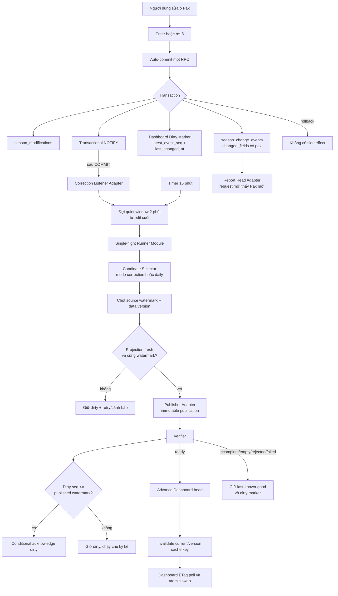

# Kế hoạch implementation — Daily Import maturity và Dashboard correction sau auto-save Pax

**Ngày:** 2026-09-02

**Trạng thái:** Đã chốt thiết kế; chưa implement, chưa migration, chưa deploy production

**Branch thực hiện:** `codex/live-traffic-aggregate-integration`

**ADR nền:**

- `docs/adr/2026-08-29-canonical-flight-leg-store.md`
- `docs/adr/2026-09-01-report-live-dashboard-daily-publication.md`

**Receipt nền:**

- `docs/superpowers/artifacts/2026-09-01-report-dashboard-daily-publication-implementation-receipt.md`
- `docs/superpowers/artifacts/2026-09-01-dashboard-hybrid-runner-production.md`
- `docs/superpowers/artifacts/2026-09-01-report-dashboard-ready-cutover-production.md`

## 1. Mục tiêu

Hoàn thiện hai lát cắt A+B trên kiến trúc Report live và Dashboard Daily Publication đã cutover:

1. **A — Daily Import maturity:** Daily Import đã commit, coverage `complete`, Ops Date đã kết thúc và toàn bộ active leg đã có Pax thì có thể tạo Daily Publication ngay. Mốc T+24 chỉ dùng để phân loại `Pax NULL` đã quá hạn thành missing, không được chặn Pax đã biết.
2. **B — Pax correction:** mỗi lần người dùng Enter hoặc rời ô Pax trong Daily Schedule tạo đúng một auto-commit RPC. Transaction đó đồng thời ghi overlay, event và durable Dashboard dirty marker; sau commit, correction runner coalesce 2 phút rồi republish theo watermark mới nhất.
3. Report tiếp tục đọc live canonical committed data ở request kế tiếp. Dashboard tiếp tục chỉ đọc immutable ready publication và giữ last-known-good khi correction chưa đủ điều kiện hoặc thất bại.
4. `Pax NULL` luôn là chưa có dữ liệu/missing; `Pax 0` luôn là true-zero.

Không nằm trong plan này:

- thay đổi trải nghiệm auto-save theo ô của Daily Schedule;
- cho Dashboard đọc trực tiếp live Report;
- xóa Publication Ledger, projection hoặc rollback snapshot;
- chạy migration, sửa production data hoặc tạo publication production khi chưa có phê duyệt triển khai riêng;
- dùng mock data để kết luận số liệu production.

## 2. Done means

- Một cell save Pax thành công tạo cùng một transaction gồm `season_modifications`, `season_change_events` với `changed_fields` chứa `pax`, và Dashboard dirty marker có `latest_event_seq` đúng.
- Rollback RPC không để lại modification, event, dirty marker hoặc wake signal.
- Report trả Pax mới ở read version kế tiếp; read version cũ bị từ chối khi watermark thay đổi.
- Các edit liên tiếp được coalesce theo 2 phút tính từ `last_changed_at` cuối cùng.
- Correction của ngày lịch sử vẫn republish cumulative Dashboard đến Business Date hiện hành dù một ngày mới hơn đang `maturity_incomplete`.
- Edit phát sinh trong lúc publish không bị mất: dirty marker chỉ được clear có điều kiện khi `latest_event_seq <= publication.source_watermark`.
- Publisher chỉ advance head khi projection `fresh`, watermark/data version khớp, checksum và A+D hợp lệ, đồng thời không biến `NULL` thành `0`.
- Dashboard public nhìn thấy publication mới trong SLA tối đa 10 phút ở điều kiện vận hành bình thường; nếu không đạt phải có trạng thái và cảnh báo truy vết được.
- PostgreSQL 17 clone rehearsal, contract tests, failure tests, cache verification và production canary được chứng minh bằng receipt riêng.

## 3. Bằng chứng code hiện tại và khoảng trống

| Phạm vi | Bằng chứng hiện tại | Khoảng trống cần xử lý |
| --- | --- | --- |
| Auto-save ô | `app/src/app/(desktop)/daily/page.tsx`, `handleCellCommit`, gọi `runNativeScheduleMutation(..., 'daily')` khi Enter/rời ô | Chưa có durable correction orchestration gắn với transaction server-authoritative |
| Mapping Pax | `app/src/lib/dailySchedule.ts`, `buildDailyCellModification`, map `pax/arrPax/depPax` sang `mod.pax = nullableNumber(value)` | Cần test riêng `NULL`, `0`, số dương và edit ARR/DEP |
| Mutation RPC | `app/src/lib/nativeLocalSeasonStore.ts` gọi `applySeasonServerMutationV1` với `source='daily'`; `app/src/lib/supabaseStore.ts` gọi `apply_season_server_mutation_v1` | Definition production của RPC không có migration đầy đủ trong repo; cần capture/guard current definition trước additive replacement |
| Event contract | `app/src/lib/seasonChangeEvents.ts` có logic sinh `changedFields`; production evidence gần nhất cho manual Pax event vẫn có `changed_fields=[]` dù `op_payload.operation.mod.pax` tồn tại | Phải chuẩn hóa producer để event Pax luôn có `pax`; trigger tạm thời phải đọc an toàn cả `changed_fields` và payload cũ |
| Daily acceptance | `20260901114500_public_traffic_daily_acceptance.sql` chỉ capture `target_type='dailyImport'` và `kind='commit_daily_schedule_canonical_v2'` | Đúng cho import; chưa bắt manual correction |
| Hybrid wake | `20260901123000_public_dashboard_hybrid_runner.sql` gửi transactional `pg_notify('public_dashboard_daily_wake', ...)` sau Daily Import acceptance | Chưa có wake payload/kind và debounce cho correction |
| Candidate | `reporting.select_public_dashboard_candidate_v1` chọn ngày theo continuous coverage, projection và maturity | Một ngày mới chưa mature có thể chặn republish correction của historical date/current head |
| Pax maturity | `20260831210000_public_traffic_live_aggregate_v2.sql` đặt `is_due = scheduled_local_at + interval '1 day' <= data_as_of`; `reported_pax` hiện chỉ cộng khi `is_due` | Pax đã biết từ authoritative Daily Import vẫn bị giữ lại đến T+24 |
| Runner | `deploy/traffic-report/seasonal-traffic-dashboard-runner` có single-flight, selector, publisher, verifier, public cache check và timer 15 phút | Chưa có correction mode, durable debounce, conditional acknowledgement và retry từ dirty marker |
| Public cache | Edge đặt version `s-maxage=30`, publication `s-maxage=60`; Nginx cache route tối đa 60 giây | Verifier hiện có thể báo `public_cache_stale`; cần invalidation đúng key hoặc wait theo cache SLA |
| Dashboard poll | `ANNUAL_KPI_VERSION_POLL_MS = 60 * 1000`; client dùng ETag và reload publication khi version đổi | Giữ cơ chế này; phải test không blank last-known-good và không ghép hai publication |

## 4. Cấu trúc đích



## 5. Quyết định kiến trúc

### 5.1. Deep Correction Orchestration Module

Runner hiện tại được mở rộng thành một Deep Module có Interface nhỏ:

```text
run(trigger_kind, optional_marker_id)
listen(channel)
```

Implementation che giấu các seam nội bộ:

- Candidate Selector: chọn `daily` hoặc `correction` và chốt Business Date/watermark.
- Publisher Adapter: gọi publisher idempotent hiện có.
- Verifier: xác minh DB head, checksum, contract, public cache và conditional dirty acknowledgement.
- Alert Adapter: ghi journal; external delivery là Adapter tùy chọn, không làm publish thất bại nếu chưa cấu hình.

Depth này tạo Leverage vì Daily Import, correction wake, timer recovery và manual run dùng chung một Interface; Locality giữ toàn bộ retry/idempotency/verification ở runner thay vì rò vào Daily UI hoặc import RPC.

### 5.2. Dirty marker là operational state, không phải publication history

Tạo bảng private trong `reporting`, tên cuối cùng chốt khi implement, với Interface dự kiến:

| Field | Ý nghĩa/invariant |
| --- | --- |
| `dashboard_key`, `year` | Khóa logical marker; unique theo dashboard/year |
| `affected_from_date`, `affected_to_date` | Khoảng Ops Date nhỏ nhất/lớn nhất đã bị correction |
| `latest_event_seq` | Watermark event mới nhất cần phản ánh |
| `last_changed_at` | Mốc reset debounce |
| `status` | `dirty`, `processing`, `retry`, `applied` |
| `attempt_count`, `next_attempt_at` | Backoff/recovery, không busy-loop |
| `last_error_code`, `last_error_at` | Quan sát lỗi gần nhất |
| `applied_publication_id`, `applied_watermark` | Receipt acknowledgement gần nhất |
| `updated_at` | Operational freshness |

Dirty marker được upsert/mutate vì nó là work queue state. Publication Ledger vẫn bất biến; failed attempt không bị xóa hoặc sửa thành công giả.

Không grant table hoặc internal functions cho `public`, `anon`, `authenticated`, `service_role` nếu không cần. Root-owned runner truy cập qua database role nội bộ. Public chỉ đọc aggregate wrapper hiện hành.

### 5.3. Transactional capture đúng với auto-save từng ô

Trong cùng transaction của `apply_season_server_mutation_v1`:

1. validate mutation/source/operator/version;
2. upsert `season_modifications`;
3. insert `season_change_events` và lấy `server_seq`;
4. nếu event là effective Pax correction từ `source='daily'`, upsert dirty marker bằng `greatest(latest_event_seq, server_seq)` và mở rộng affected date;
5. gọi `pg_notify`;
6. commit.

PostgreSQL chỉ giao NOTIFY sau commit. Nếu bất kỳ bước nào rollback, không có modification, event, dirty marker hoặc wake.

Trigger nhận diện correction trong giai đoạn tương thích:

- đường chuẩn: `target_type='modification'` và `changed_fields` chứa `pax`;
- fallback có thời hạn: kiểm tra allowlisted shape trong `op_payload` cho operation `modification` có key `pax` và source `daily`;
- không dùng text search trên JSON, không wake vì edit gate/stand/schedule;
- xóa fallback sau khi mọi client version đã qua soak và telemetry không còn event Pax thiếu `changed_fields`.

### 5.4. Debounce/coalesce chính xác

- Mỗi cell save thành công cập nhật `last_changed_at`.
- Listener chỉ đánh thức runner; không giữ connection rồi `sleep 120` trong import/mutation transaction.
- Nếu `now < last_changed_at + 2 phút`, runner trả transient receipt và lên lịch lại đúng `next_attempt_at`.
- Nhiều edit cùng năm được coalesce thành một publication ở watermark mới nhất.
- Timer persistent 15 phút là recovery nếu NOTIFY bị mất, host restart hoặc lần chạy trước lỗi.
- Single-flight lock bao trùm selection → publish → verify → acknowledge; không cho hai publication race cùng head.

### 5.5. Hai candidate mode

**Daily mode** giữ logic đã chốt:

- ngày lớn nhất đã kết thúc theo Ops Date 05:00–04:59;
- continuous coverage `complete`;
- import/reconciliation acceptance hoàn tất;
- projection `fresh` cùng watermark/data version;
- quality/maturity đạt;
- không phải ngày tương lai.

**Correction mode** không bị ngày mới hơn chưa mature chặn:

- nếu `affected_to_date <= current head Business Date`, republish cumulative từ đầu năm đến chính current head Business Date ở watermark mới;
- nếu affected date lớn hơn current head, chuyển về Daily mode và chỉ advance khi ngày đó đủ eligibility;
- nếu correction nằm ngoài năm/head được chọn, route đúng marker theo year; không silently publish sai năm;
- idempotency key vẫn ổn định: `annual-kpi:{year}:{business-date}:{watermark}`;
- cùng key trả lại cùng receipt; watermark mới tạo publication mới và giữ publication cũ.

### 5.6. Conditional acknowledgement chống mất edit

Sau `ready`, Verifier chỉ chuyển marker sang `applied` khi:

```text
marker.latest_event_seq <= publication.source_watermark
```

Update phải có điều kiện trong SQL. Nếu người dùng sửa thêm trong lúc Publisher đang chạy, `latest_event_seq` lớn hơn watermark đã publish nên marker vẫn `dirty`; runner chạy lại sau quiet window mới. Không dùng read-then-unconditional-update.

### 5.7. Tách Pax known khỏi Pax overdue

Canonical Traffic Metrics Module cần hai khái niệm riêng:

- `pax_reported`: leg có `pax is not null`; số đã biết được cộng ngay khi source authority/coverage cho phép.
- `pax_overdue_missing`: leg có `pax is null` và đã quá maturity T+24; đây mới là missing cần cảnh báo/chặn theo quality contract.

Đối với authoritative Daily coverage đã `complete` và Ops Date đã kết thúc:

- Pax non-null được tính vào Report/Dashboard ngay, không đợi `scheduled_local_at + 1 day`;
- Pax null trước T+24 vẫn là `NULL/not-due`, tuyệt đối không phải `0`;
- Pax null sau T+24 là `NULL/overdue-missing`;
- Dashboard eligibility dùng explicit counts cho reported/not-due/overdue-missing, không suy ra từ `due_legs = flights` cũ;
- Report timeline/status và Publisher đọc cùng một Implementation, không tự sửa riêng selector để “lách” maturity.

Đây là thay đổi semantic contract; tăng metrics contract version nếu payload meaning thay đổi, đồng thời giữ Adapter tương thích hoặc cutover atomically.

## 6. Danh sách file dự kiến

### Modify

- `app/src/lib/seasonChangeEvents.ts`
- `app/src/lib/seasonChangeEvents.test.ts`
- `app/src/lib/nativeLocalSeasonStore.ts`
- `app/src/lib/nativeLocalSeasonStore.source.test.ts`
- `app/src/lib/dailySchedule.ts`
- test tương ứng của Daily Schedule/Daily page source contract
- `app/supabase/schema.sql`
- `app/supabase/tests/public_traffic_report_v1_pglite.mjs`
- `app/scripts/traffic-report-edge-contract.test.mjs`
- `app/supabase/functions/traffic-report/index.ts`
- `app/src/lib/trafficReportV2Contract.ts`
- `app/src/lib/annualPassengerKpiContract.ts`
- `app/src/app/(public-report)/reports/traffic/dashboard/AnnualPassengerKpiDashboard.tsx`
- `deploy/traffic-report/seasonal-traffic-dashboard-runner`
- `deploy/traffic-report/seasonal-traffic-dashboard-runner.service`
- `deploy/traffic-report/seasonal-traffic-dashboard-runner.timer`
- `deploy/traffic-report/nginx.conf`
- `deploy/traffic-report/nginx-staging.conf`
- `docs/runbooks/public-traffic-report-deploy.md`
- `context.md` và ADR liên quan sau khi implementation contract được chốt

### Add khi implementation

- một additive migration cho event contract + Dashboard dirty marker + transactional correction wake;
- một additive migration cho canonical Pax reported/overdue semantics và candidate correction mode;
- targeted SQL/PGlite tests cho transaction, marker, selector, publisher và conditional acknowledgement;
- runner tests cho debounce, timer recovery, single-flight, retry và cache SLA;
- clone rehearsal SQL/runner và implementation/production receipt mới.

Không sửa historical migrations. Tên/timestamp migration chỉ tạo tại thời điểm implement để tránh thứ tự giả.

## 7. Kế hoạch thực hiện theo phase

### Phase 0 — Baseline và branch gate

1. Tiếp tục trên `codex/live-traffic-aggregate-integration`; branch này đã chứa cả Report và Dashboard, nên không merge hai nhánh riêng trước khi làm.
2. Chụp `git status`, commit SHA, migration list và schema drift.
3. Dump có kiểm soát current production definition của `apply_season_server_mutation_v1`, trigger, grants và owner; redacted secrets.
4. Chụp read-only baseline: head publication, latest attempt, dirty-equivalent gaps, source watermark, data version, projection state, coverage, Edge/Nginx cache headers.
5. Chạy contract/build baseline và lưu receipt.

**Gate 0:** workspace không có thay đổi không liên quan; production chỉ read-only; function definition source được xác nhận thay vì suy đoán từ tên RPC.

### Phase 1 — Characterization contract trước refactor

Thêm test qua Interface cho:

- cell edit Pax positive, `0`, blank → `NULL`;
- ARR Pax và DEP Pax map đúng leg;
- one cell save → one RPC → one event;
- `source='daily'`, `target_type='modification'`, `changed_fields=['pax']`;
- idempotent retry cùng `clientMutationId` không tạo event/marker trùng;
- non-Pax edit không tạo correction marker;
- active/deleted/superseded/duplicate leg không làm correction sai canonical row;
- Report read version đổi khi event watermark đổi.

**Gate 1:** test tái hiện được event Pax `changed_fields=[]` hiện tại trước khi fix và pass sau khi producer/transaction contract được sửa.

### Phase 2 — Event contract và transactional dirty marker

1. Sửa producer để `changedFields` đến RPC chứa đúng key từ mutation payload, kể cả server-authoritative path không có local base snapshot.
2. Add migration tạo private marker table/index/check constraint.
3. Guard exact current RPC definition rồi replace/add trigger tại seam đã xác nhận.
4. Upsert marker và transactional NOTIFY sau event insert, trong cùng transaction.
5. Payload wake chỉ chứa identifier tối thiểu; runner phải đọc durable state từ DB, không tin NOTIFY là source of truth.
6. Cập nhật clean-start `schema.sql`, owner/grants/comments.

**Gate 2:** forced exception cuối transaction chứng minh không có partial write/wake; ACL test chứng minh public roles không đọc/ghi marker.

### Phase 3 — Canonical Pax maturity A

1. Tạo characterization matrix cho `reported`, `not_due_null`, `overdue_missing`, `true_zero` tại cùng watermark nhưng nhiều `data_as_of`.
2. Refactor Canonical Traffic Metrics Implementation để Pax known từ authoritative completed Daily coverage được tính ngay.
3. Giữ T+24 chỉ cho overdue missing; không dùng `coalesce(pax, 0)`.
4. Trả explicit counters/status đủ cho Report và Publisher; cập nhật contract decoder/version nếu cần.
5. Cập nhật Candidate Selector quality rule theo semantic mới, không chỉ đổi điều kiện `due_legs=flights`.
6. Differential với v2 cũ phải phân loại: flight/A/D không đổi; Pax chỉ khác ở đúng authoritative-known-before-T+24 cases đã duyệt.

**Gate 3:** Daily Import đủ Pax sau Ops Date completion có `ready_candidate`; Pax null chưa T+24 vẫn null/not-due; quá T+24 trở thành missing và fail-closed theo policy.

### Phase 4 — Correction Candidate Selector và acknowledgement

1. Mở rộng selector bằng `trigger_kind`/marker context nhưng giữ một Interface runner ổn định.
2. Implement current-head republish cho historical correction.
3. Giữ Daily eligibility cho correction vượt current head.
4. Chốt watermark/data version/projection state trước publish; publisher tiếp tục kiểm tra expected watermark.
5. Implement conditional acknowledge theo `latest_event_seq`.
6. Ghi receipt gồm trigger kind, marker/event range, selected Business Date, watermark, publication id và acknowledgement outcome.

**Gate 4:** test historical correction khi ngày mới hơn `maturity_incomplete` vẫn tạo publication cho current head; concurrent edit giữa compute và acknowledge giữ marker dirty.

### Phase 5 — Runner debounce/retry/cache

1. Listener nhận cả Daily Import wake và correction wake.
2. Correction marker chưa qua quiet window trả retryable outcome, không publish sớm.
3. Single-flight vẫn dùng lock hiện có; không thêm runner song song độc lập.
4. Retry: wake ngay, rồi tại quiet-window boundary; lỗi transient theo backoff; timer 15 phút tiếp quản.
5. Sau `ready`, invalidate/purge đúng current publication + version cache key nếu hạ tầng hỗ trợ; immutable publication-by-id không purge.
6. Nếu không purge được, Verifier đợi đến tổng Edge/Nginx cache SLA và phân biệt `cache_pending` với `failed`.
7. Dashboard giữ poll ETag 60 giây và atomic state swap; background error không `setSnapshot(null)`.

**SLA budget mục tiêu:** debounce 2 phút + compute/verify thường dưới 1 phút + cache tối đa khoảng 1 phút + poll tối đa 1 phút; cảnh báo nếu end-to-end vượt 10 phút.

**Gate 5:** burst edit kéo dài 3 phút chỉ publish một lần sau edit cuối; public endpoint và rendered Dashboard thấy đúng publication trong SLA; cache cũ tức thời không bị ghi nhận là publisher failure.

### Phase 6 — Rehearsal không đụng production

1. PGlite/contract tests.
2. PostgreSQL 17 clone từ production schema/data snapshot theo quy trình đã dùng.
3. Rehearse migration upgrade và rollback/disable path.
4. Chạy matrix correction trên clone bằng bản sao dữ liệu thật, không tạo mock để kết luận production totals.
5. Rehearse listener/systemd/timer restart, lost NOTIFY, stale projection, watermark change, failed publisher và cache expiry.
6. So sánh Report live và Dashboard publication ở cùng Business Date/watermark/data-as-of.
7. Lưu receipt gồm before/after totals, A/D, daily rows, null/zero counts, checksum, timings và logs.

**Gate 6:** zero unexplained differential; không mất edit; last-known-good luôn tồn tại; restore/disable rehearsal pass.

### Phase 7 — Production rollout sau phê duyệt riêng

1. Backup/restore point và capture exact pre-state.
2. Apply additive migrations; chưa bật listener correction.
3. Deploy runner/Edge/Nginx changes; verify unit files và config syntax.
4. Chạy shadow correction selector/marker observation, không advance head.
5. Bật listener + timer; Daily Import path cũ vẫn hoạt động.
6. Canary một Pax cell được phê duyệt: ghi trước giá trị, target leg, Ops Date, expected watermark và rollback value.
7. Xác minh Report request mới, event, marker, debounce, publication, head, public endpoint, cache headers và rendered Dashboard.
8. Theo dõi ít nhất một Daily Import tiếp theo và một historical correction.
9. Chỉ merge integration branch về nhánh đích sau source gates/receipt; production deployment và git merge là hai hành động riêng.

**Gate 7:** canary đạt SLA và đúng số; no unexplained changes ngoài target; production receipt và rollback evidence hoàn chỉnh.

## 8. Test/validation matrix bắt buộc

| Case | Report expected | Dashboard expected |
| --- | --- | --- |
| Pax `NULL → 212` ngày lịch sử | Request mới cộng 212; version cũ bị reject | Sau debounce tạo publication mới; head mới cộng 212 |
| Pax `212 → 0` | Hiển thị/tính true-zero, không missing | Publication ghi reported leg với Pax 0 |
| Pax `0 → NULL` trước T+24 | Pax null/not-due, không đổi thành 0 | Policy không advance nếu chưa đủ quality; giữ last-known-good |
| Pax `NULL` sau T+24 | Overdue missing | Attempt incomplete/failed-closed theo contract |
| Nhiều ô sửa liên tiếp | Mỗi request phản ánh committed watermark tương ứng | Một publication sau 2 phút từ edit cuối |
| Edit trong lúc publish | Request sau cùng thấy edit mới nhất | Publication cũ có thể ready; marker vẫn dirty và tạo publication kế |
| Watermark đổi trước publisher | Read version conflict rõ ràng | `rejected_version`, head cũ giữ nguyên |
| Projection stale/lệch watermark | Report báo stale/version conflict, không giả empty | Không publish; dirty giữ nguyên |
| Historical correction + ngày mới incomplete | Report live đúng cả hai ngày | Republish current head; không bị ngày mới chặn |
| Correction ở ngày sau current head | Report thấy committed data theo contract | Đi Daily mode; chưa đủ eligibility thì giữ head cũ |
| Duplicate retry cùng key | Không nhân đôi dữ liệu | Trả cùng receipt, không tạo publication trùng |
| Publisher/Verifier/cache lỗi | Report không phụ thuộc publication | Dashboard giữ last-known-good và hiện freshness đúng |
| A/D reconciliation | Total Pax = A + D khi có reported legs | Verifier pass hoặc fail-closed |
| Zero-flight certified day | Timeline đúng zero theo coverage | Có thể ready, không bị coi là unexpected empty |

## 9. Các lệnh verification dự kiến

Chạy từ `app` sau khi có Implementation:

```powershell
npm run test:rules
npm run test:traffic-report-contract
npm run build:traffic-report
npx tsc --noEmit --pretty false
npm run lint
```

Chạy thêm targeted commands được bổ sung cho:

- season change event producer;
- Daily auto-save source contract;
- PGlite dirty marker/candidate/publisher;
- Edge publication/version cache contract;
- runner shell/systemd behavior;
- PostgreSQL 17 clone differential.

Build/test pass không thay production acceptance. Browser validation phải kiểm tra exact rendered Pax/Business Date/publication id trên public URL.

## 10. Observability và cảnh báo

Log/metric tối thiểu:

- correction marker age và `latest_event_seq - applied_watermark`;
- time từ cell RPC commit → NOTIFY → eligible → publish → public visible;
- debounce coalesced edit count;
- candidate mode/status/reason;
- projection watermark/data version mismatch;
- publisher duration/status/idempotency reuse;
- conditional acknowledgement success/race-retained;
- active Business Date/publication age;
- public cache pending/stale duration;
- Pax reported/not-due/overdue-missing/true-zero counts.

Cảnh báo khi:

- marker dirty quá 10 phút trong điều kiện projection fresh;
- correction attempt mới nhất `empty`, `failed` hoặc lặp `rejected_version`;
- current head không đổi sau successful verifier;
- checksum/A+D/null invariant sai;
- public endpoint chưa thấy publication sau cache SLA;
- Dashboard Business Date chậm hơn eligible Daily candidate;
- listener/timer không chạy hoặc lock bị giữ bất thường.

## 11. Rủi ro và cách khống chế

| Rủi ro | Cách khống chế |
| --- | --- |
| RPC production khác schema repo | Dump + exact-definition guard; migration từ chối nếu shape lệch |
| Event Pax cũ thiếu `changed_fields` | Producer fix + allowlisted payload fallback có telemetry và ngày retire |
| Lost wake | Durable marker + persistent timer; NOTIFY chỉ là tín hiệu |
| Edit bị clear trong race | Conditional SQL acknowledgement theo event seq/watermark |
| Correction lịch sử bị ngày mới chặn | Candidate correction mode republish current head |
| Pax known vẫn bị T+24 lọc khỏi tổng | Refactor Canonical Traffic Metrics Module, không sửa selector đơn lẻ |
| Cache làm Dashboard chậm | Exact-key purge hoặc verifier wait đúng TTL; ETag poll 60 giây |
| Publication storm | 2-minute quiet window + single-flight + stable idempotency key |
| `NULL` bị biến thành `0` | Contract/SQL/client tests ở mọi layer; checksum receipt |
| Rollout ảnh hưởng Daily Import | Additive migration, shadow first, listener feature switch và rollback unit |

## 12. Rollback

- Tắt correction listener/wake handling; timer vẫn có thể chạy Daily mode hiện hành.
- Disable correction selector và dirty-marker trigger bằng additive rollback/feature switch; không xóa marker/attempt history trong incident.
- Trả Canonical Traffic Metrics contract về implementation trước nếu maturity differential không đạt; head vẫn là last-known-good.
- Trả Edge/Nginx cache config về bản trước nếu invalidation có lỗi.
- Không hard-delete publication, failed attempt hoặc audit event.
- Không drop marker table/function trong cùng incident; cleanup chỉ sau soak và phê duyệt riêng.

## 13. Thứ tự commit đề xuất

1. `test(daily): characterize pax autosave event contract`
2. `feat(reporting): add durable dashboard correction marker`
3. `fix(reporting): separate reported pax from overdue maturity`
4. `feat(dashboard): select and publish pax corrections`
5. `feat(runner): debounce correction wakes and verify cache`
6. `test(reporting): add correction race and clone rehearsal`
7. `docs(reporting): record correction workflow and rollout receipt`

Mỗi commit phải độc lập review được; không trộn migration, UI cleanup không liên quan hoặc production receipts vào cùng một commit lớn.

## 14. Kết luận branch/merge

Không cần merge riêng “nhánh Report” và “nhánh Dashboard” trước khi bắt đầu. `codex/live-traffic-aggregate-integration` là workspace hợp nhất và đã có Report live, Daily Publication, runner, verifier và Dashboard cutover. Tiếp tục implement tại đây giúp giữ Locality của thay đổi và chạy được test xuyên suốt hai read path.

Sau khi Phase 0–6 pass, commit source trên integration branch. Merge về nhánh đích và production cutover chỉ thực hiện theo gate/phê duyệt tương ứng; không coi merge code là bằng chứng production đã cập nhật.
